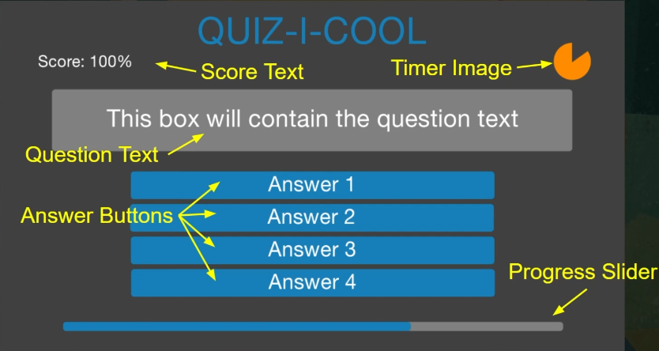

# Quiz Master

## Description

This is a game where you play as a quiz master. You have to answer questions to get the best score and reach the end of the quiz.

## Game design

* Answer questions of multiple choice
* Limited time to answer each question
* UI focused gameplay
  
### Game mechanics

* Mechanisms to store and retrieve questions
* Buttons to select answers
* Timer to put pressure on the player
* Progress bar to show the player how far they are in the quiz
* Scoring system to give the player feedback on their performance
* A way to restart the quiz when the player finishes it

### Player Experience

* Knowledgeable and intelligent

### Core Mechanic

* Test your knowledge

### Game Loop

Answer a set number on a topic within the given time.